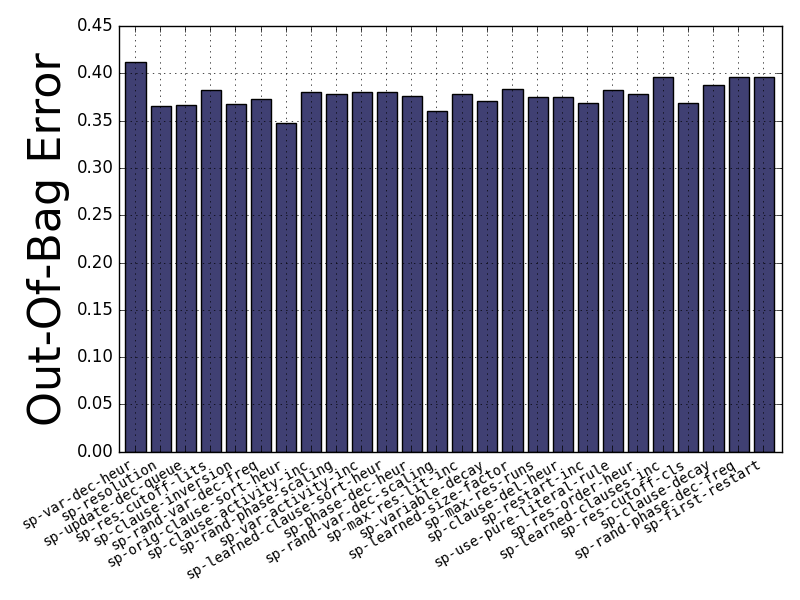
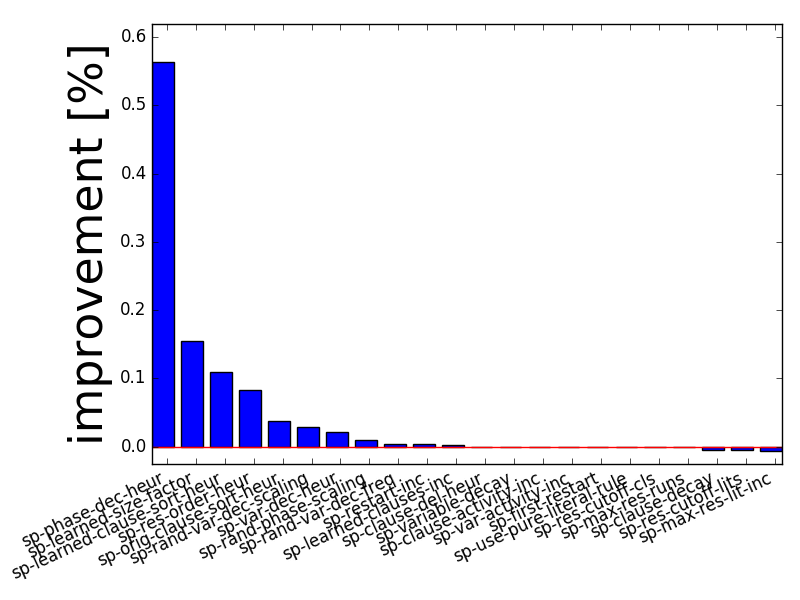
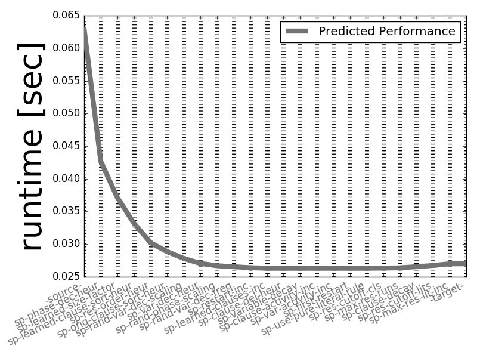

# PyImp

**PyImp** is now on pypi.
To install it simply run
`
pip install pyimp
`
If you want to run fANOVA with PyImp you will have to manually install it via
`
pip install git+http://github.com/automl/fanova.git@master
`

**PyImp** is an easy to use tool that helps developers to identify the most important parameters of their algorithms.
Given the data of a configuration run with [*SMAC3*](https://github.com/automl/SMAC3), PyImp allows one to use *Forward Selection*, *Efficient Ablation* and *Influence Models* to determine which Parameters have the most influence over the algorithms behaviour.

PyImp can be used with argcomplete. To enable autocompletion of PyImp
arguments, add the following line to your .bashrc or .profile:
`
eval "$(register-python-argcomplete pyimp)"
`

The documentation can be found [here](https://automl.github.io/ParameterImportance).

Example results of the package look as follows:

## Forward Selection
An example call of forward-selection:

```
cd examples/branin
pimp --scenario_file smac3-out/scenario.txt --history smac3-out/runhistory.json --modus forward-selection
```

Results in an image such as:



## Surrogate-ablation
An example call of surrogate-ablation:

```
cd examples/branin
pimp --scenario_file smac3-out/scenario.txt --history smac3-out/runhistory.json --trajectory smac3-out/traj.json --modus ablation`
```

Results in two plots:



## Reading in multiple runhistories
To read in multiple runhistories, check out the spear-qcp example:

```
cd examples/spear_qcp
pimp --scenario_file scenario.txt --history './*/runhistory.json' --modus forward-selection
```